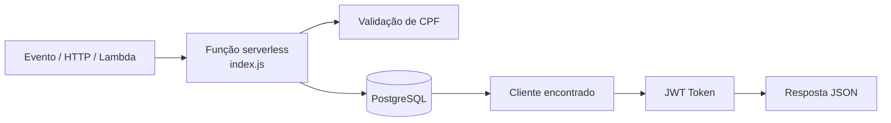

# TechChallengerFiap-ServerLess

## Propósito

Este repositório implementa uma função serverless para autenticar clientes por CPF. Ele recebe um evento com o documento, valida o CPF, consulta o cliente no PostgreSQL e retorna um token JWT para uso na API principal.

## Tecnologias utilizadas

- Node.js
- JavaScript
- PostgreSQL
- `pg` (cliente PostgreSQL)
- `jsonwebtoken`
- AWS Lambda / ambiente serverless
- dotenv / variáveis de ambiente

## Arquitetura específica do repositório



A função é enxuta e focada em autenticação: ela valida o documento, recupera os dados do cliente, verifica se o cliente está ativo e retorna um token JWT.

## Como executar

### Pré-requisitos

- Node.js instalado
- PostgreSQL acessível
- Variáveis de ambiente configuradas:

```bash
export DATABASE_URL="postgresql://..."
export JWT_SECRET="sua-chave"
export JWT_EXPIRES_IN="24h"
```

### Execução local

```bash
cd TechChallengerFiap-ServerLess
npm install
node -e "const fn = require('./index').handler; fn({ body: JSON.stringify({ cpf: '12345678909' }) }).then(console.log).catch(console.error)"
```

## Deploy

Este projeto está estruturado para ser implantado em um ambiente serverless, como AWS Lambda ou outra plataforma compatível com funções sem servidor. O deploy real depende da infraestrutura da sua cloud.

Exemplo genérico:

```bash
npm install
zip -r function.zip .
```

Depois, importe o pacote na plataforma serverless escolhida e configure as variáveis `DATABASE_URL` e `JWT_SECRET`.

## Passos para execução e deploy

1. Configurar `DATABASE_URL` e `JWT_SECRET`.
2. Garantir que a tabela `clientes` exista com os campos necessários.
3. Validar o CPF de entrada.
4. Executar a função localmente para testar o fluxo.
5. Publicar a função em um ambiente serverless.
6. Testar o retorno do token e validar os cenários de erro.

## Estrutura do projeto

```text
TechChallengerFiap-ServerLess/
├── index.js
├── package.json
├── README.md
└── ...
```

## Link para Swagger / Postman

Este repositório não possui Swagger próprio, porque a autenticação serverless normalmente é testada por payloads JSON diretamente. Para a documentação da API principal do sistema, use:

- Swagger da API principal: http://localhost:3000/api-docs
- Postman: use o payload abaixo para enviar o body com `cpf` e validar a resposta JWT.

### Exemplo de payload de teste

```json
{
  "body": "{\"cpf\":\"12345678909\"}"
}
```

## Observações

- A função exige que o cliente exista na tabela `clientes`.
- Se o cliente estiver inativo ou não existir, a resposta retorna status apropriado.
- O token emitido tem expiração padrão configurável via `JWT_EXPIRES_IN`.

---
